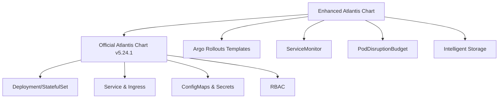

# Atlantis Helm Chart Documentation

Welcome to the **Enhanced Atlantis Helm Chart** documentation site!

## 🚀 Quick Start

This enhanced Helm chart provides a production-ready wrapper around the [official Atlantis chart](https://github.com/runatlantis/helm-charts) with additional enterprise features.

### Add Helm Repository

```bash
helm repo add k8sforge-atlantis https://k8sforge.github.io/atlantis-chart
helm repo update
```

### Install Atlantis

```bash
helm install my-atlantis k8sforge-atlantis/atlantis \
  --set orgAllowlist="github.com/myorg/*" \
  --set github.user="myuser" \
  --set github.token="mytoken"
```

## 📊 Features

### ✅ Enhanced Features (Wrapper Additions)
- **🔄 Argo Rollouts**: Blue-Green, Canary, and Rolling Update deployment strategies
- **💾 Intelligent Storage**: Auto EBS/EFS selection based on replica count  
- **📈 Enhanced Monitoring**: ServiceMonitor for Prometheus integration
- **🛡️ High Availability**: PodDisruptionBudget support
- **🔍 Health Checks**: Platform-agnostic health check annotations

### ✅ Official Chart Features (Included)
- **🌐 Multi-Git Support**: GitHub, GitLab, Bitbucket, Azure DevOps, Gitea
- **☁️ Cloud Integration**: AWS, GCP, Azure credentials management
- **🔐 Security**: RBAC, service accounts, secret management
- **📦 Flexible Deployment**: Deployment or StatefulSet options
- **⚙️ Advanced Config**: Custom workflows, server-side repo config

## 📚 Documentation

- **[Chart Repository](https://github.com/k8sforge/atlantis-chart)** - Source code and issues
- **[Official Atlantis Docs](https://www.runatlantis.io/)** - Atlantis configuration and usage
- **[Examples](https://github.com/k8sforge/atlantis-chart/blob/main/EXAMPLES.md)** - Configuration examples

## 🔧 Configuration

| Parameter | Description | Default |
|-----------|-------------|---------|
| `deployment.type` | Deployment type: `rollout` or `deployment` | `rollout` |
| `deployment.strategy` | Strategy: `blueGreen`, `canary`, `rollingUpdate` | `blueGreen` |
| `persistence.enabled` | Enable persistent storage | `false` |
| `monitoring.serviceMonitor.enabled` | Enable Prometheus ServiceMonitor | `false` |
| `podDisruptionBudget.enabled` | Enable PodDisruptionBudget | `false` |

See the [full configuration reference](https://github.com/k8sforge/atlantis-chart/blob/main/README.md#configuration) for all options.

## 🏗️ Architecture



## 📖 Examples

### Basic Installation
```bash
helm install atlantis k8sforge-atlantis/atlantis \
  --set orgAllowlist="github.com/myorg/*" \
  --set github.user="myuser" \
  --set github.token="mytoken"
```

### Blue-Green Deployment
```bash
helm install atlantis k8sforge-atlantis/atlantis \
  --set deployment.type=rollout \
  --set deployment.strategy=blueGreen \
  --set orgAllowlist="github.com/myorg/*"
```

### With Persistence & Monitoring
```bash
helm install atlantis k8sforge-atlantis/atlantis \
  --set persistence.enabled=true \
  --set monitoring.serviceMonitor.enabled=true \
  --set podDisruptionBudget.enabled=true \
  --set replicaCount=2
```

## 🤝 Contributing

We welcome contributions! Please see our [contributing guidelines](https://github.com/k8sforge/atlantis-chart/blob/main/CONTRIBUTING.md).

## 📄 License

This project is licensed under the Apache License 2.0 - see the [LICENSE](https://github.com/k8sforge/atlantis-chart/blob/main/LICENSE) file for details.

## 🆘 Support

- **Issues**: [GitHub Issues](https://github.com/k8sforge/atlantis-chart/issues)
- **Discussions**: [GitHub Discussions](https://github.com/k8sforge/atlantis-chart/discussions)
- **Official Atlantis**: [Slack Community](https://atlantis.slack.com)

---

**🏗️ Built with ❤️ by k8sforge**
